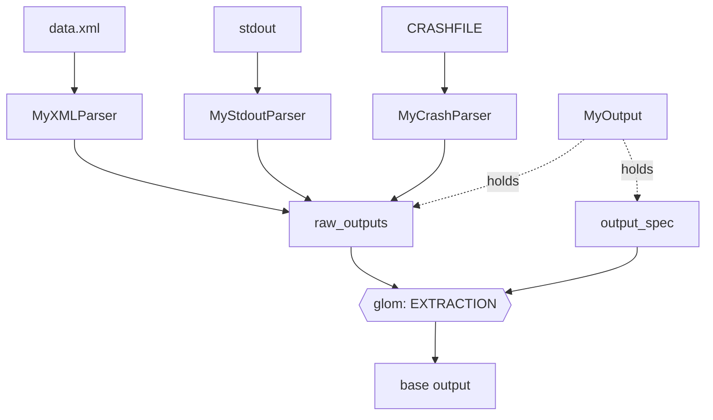
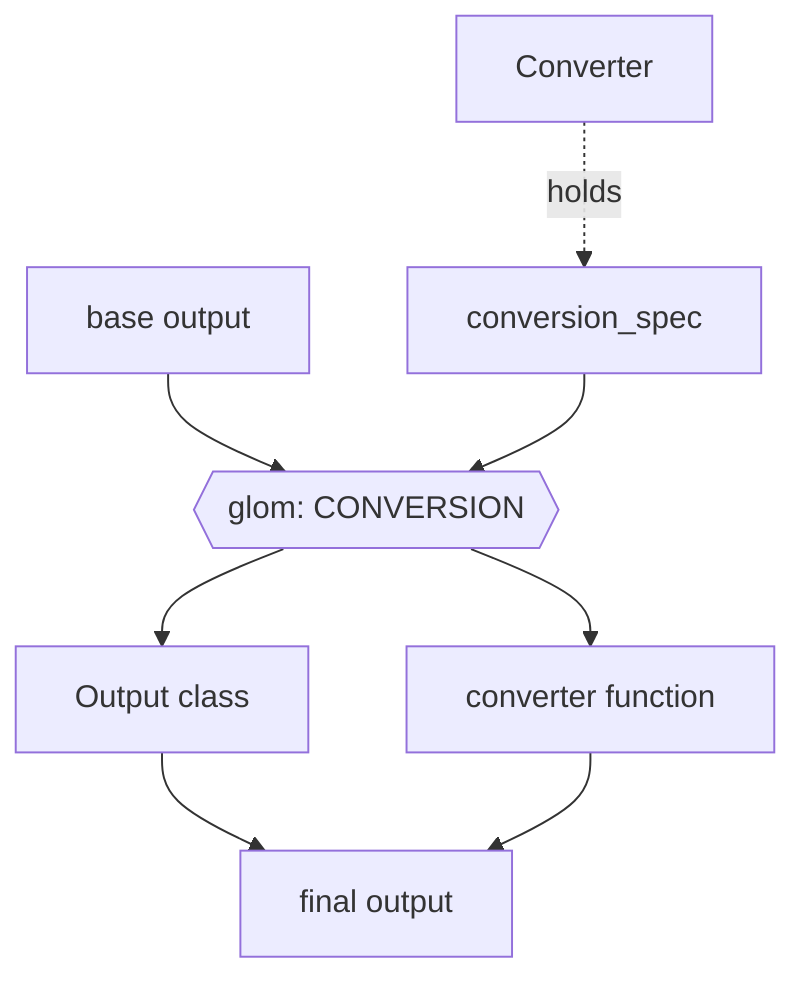

# Outputs

`dough` provides the generic machinery for parsing and exposing the outputs of a simulation code as typed Python objects.
Code-specific packages (e.g. `qe-tools` for Quantum ESPRESSO) build on this machinery to ship the actual parsers, output classes, and converters for their target code.

!!! note "Scope"

    `dough` currently implements the **output** side only: file parsers, the `BaseOutput` class, the `@output_mapping` declaration, and converters.
    An equivalent input/facade layer (input file generation, a `Calc` object aggregating input + output) is on the roadmap but not yet implemented.

On this page we discuss the design of the output functionality.
Throughout, we use a hypothetical code with output class `MyOutput` as a running example.

## Parsing



The diagram shows two key data structures:

- `raw_outputs` — a dictionary with one key per parsed file.
- **base output** — a basic Python-type representation of the desired outputs.

### One file, one parser class

All the logic related to parsing (or generating) a file should be stored on one class, with generic utility methods shared between parser classes.
The parser classes are implemented as stateless objects, which have to implement a single `parse` method with the following signature:

```python
def parse(content: str):

    parsed_data: dict = ...
    return parsed_data
```

This makes their usage and implementation very transparent.
Moreover, it means we can obtain the parsed data in a single step, e.g.:

```python
parsed_data = MyXMLParser.parse(content)
```

The abstract base class `BaseOutputFileParser` also implements a `parse_from_file` method that all parser classes can use:

```python
parsed_data = MyXMLParser.parse_from_file('run_dir/data.xml')
```

!!! note

    One motivation for having a stateful class might be performance: by storing the raw content on the class and only parsing it later, we can selectively parse what is needed.
    However, parsing the XML is most likely the most expensive operation we'll have to do here, in part because of the validation done by `xmlschema`.
    We're not sure if partially parsing the XML is an option, or we would accept losing the validation.
    There is also no performance bottleneck at this stage, even for larger XML files the parsing only takes 50 ms.

    Since the parser classes are not part of the public API at this point (see below), we can still come back on this point at a later date.
    Moreover, we can still keep the static methods in place, i.e. make changes to support partial parsing in a backwards-compatible manner.

!!! question "Should the file parser classes be part of the public API?"

    At first, I would have answered "yes" to this question.
    However, if a user can easily find the `stdout` parser, they might use it and then be rather disappointed with the result, since we _want_ to parse most outputs from the structured (XML) output.

### One output object for each calculation

Parsing one file is typically not enough to get all the outputs of a calculation.
It would be useful to gather all of these into a single "output" object from which the user can access all data they are interested in.

```python
from mypkg.outputs import MyOutput

run_dir = '/path/to/run_dir'

my_out = MyOutput.from_dir(run_dir)
my_out.outputs
```

### Raw output

For any data in the XML, writing a parser seems _easy_.
Use an XML parser to get the data as a dictionary, and done!

However, the "raw" outputs of the XML are typically not user-friendly:

- they can be very large and deeply nested, so finding a given quantity is non-trivial
- field names often follow the conventions of the simulation code, not what a user would expect
- units are rarely reported alongside the values — you need the code's documentation to interpret them

### Querying JSON

Instead, we want to query for or "extract" the outputs that most users care about: structure, Fermi energy, forces, etc.
However, we want to make sure that:

1. it is very clear from which raw output data the final output is extracted.
2. the logic of how a final output is extracted is as _localized_ as possible (to borrow a phrase from quantum mechanics).
3. we avoid having to guard against the absence of certain keys with massive `get(value, {})` chains.

In order to do this, we decided to look for a "JSON querying" tool, that allows us to quickly, robustly and with a few lines of code extract the data we are interested in.
After doing a bit of research, we decided to give [`glom`](https://glom.readthedocs.io/en/latest/index.html) a try.
As a basic example, take a Fermi-energy-like scalar:

```python
from glom import glom

glom(my_out.raw_outputs, {'fermi_energy': 'xml.output.band_structure.fermi_energy'})
```

This will return a dictionary: `{'fermi_energy': 0.04425026484437661}`.

### Defining outputs

Each extracted output is declared as a typed field on a per-code mapping class decorated with `@output_mapping`:

```python
@output_mapping
class _MyMapping:
    fermi_energy: Annotated[float, Spec("xml.output.band_structure.fermi_energy")]
    """Fermi energy in eV."""
```

This is a single source of truth: the field declaration carries the output name, type annotation, extraction `Spec`, and docstring.
Adding a new output means adding one field — nothing else.

A field may declare an explicit fallback default, returned when the `Spec` fails to resolve:

```python
job_done: Annotated[bool, Spec("stdout.job_done")] = False
"""Whether the job completed. Defaults to `False` if not parsed."""
```

Fields without an explicit default get an internal `_NOT_PARSED` sentinel, and accessing them on the `outputs` namespace raises `AttributeError` when the `Spec` didn't resolve.

The mapping class is connected to the output class via the generic typing syntax:

```python
class MyOutput(BaseOutput[_MyMapping]):
    ...
```

`BaseOutput` extracts the mapping class from this generic parameter at instantiation, then uses `dataclasses.fields()` to build `_output_spec_mapping` — a dict mapping each field name to its `Spec` (read from the field's `Annotated` metadata).
The actual extraction runs when the user accesses `outputs`: glom resolves each `Spec` against `raw_outputs`, and the results are used to populate the mapping instance.
Fields whose `Spec` cannot be resolved keep their dataclass default — either `_NOT_PARSED` or the explicit fallback.
Accessing a `_NOT_PARSED` field on the `outputs` namespace raises `AttributeError` with a clear message; fallback defaults pass through normally.

!!! note

    Moving the `Spec` into `Annotated` metadata (rather than using it as the field default) means the default slot is free for real values like `False` or `0`.
    This in turn lets callers distinguish "not parsed, but we know the sensible default" from "not parsed at all" purely via the declaration — no extra sentinel logic in callers.
    It also matches the pattern already used for sub-namespace fields, where the bare annotation `parameters: _ParametersMapping` carries the metadata (the mapping class itself) and the decorator injects a `SubMapping(hint)` default.
    Future per-field metadata (e.g. a `Unit("eV")` marker) slots in alongside `Spec` in the same `Annotated` list.

The `@output_mapping` decorator applies `@dataclass(frozen=True)` to the mapping class, making the extracted outputs immutable: users cannot overwrite a parsed result.
Beyond this, `BaseOutput` itself is designed to be stateful but immutable — it stores `raw_outputs` and derived data at construction, and no mutating methods are allowed after that point.

## Conversion to other libraries



Another goal is to be able to convert the base outputs into formats of well-known packages in the community (AiiDA, ASE, pymatgen, ...).
Some deliverables here:

- Outputs that need to be converted should be done so on the fly, and they should be available in the same way as base outputs that don't require conversion.
- We want all the converter logic of one output/library to be as localized as possible.
- All libraries should be optional dependencies defined as extras.
  When the user tries to convert to a certain library, we should check if it is available.

We implement a `BaseConverter` class that implements the basic methods for converting outputs shared by all converter classes:

- `convert`: converts the `base_output` into the `output` in the converted format of the corresponding class library.

For each supported library, we then provide a child class that inherits from `BaseConverter` (e.g. `PymatgenConverter`).
This class can define a `conversion_mapping`, which again uses `glom` to convert the (much simpler) base output dictionary into the required format.

For classes that can be entirely constructed via their constructor (`__init__` method), we can define the corresponding entry in `conversion_mapping` as a `(<output_class>, <glom_spec>)` tuple.
For example:

```python
class PymatgenConverter(BaseConverter):

    conversion_mapping = {
        "structure": (
            Structure,
            {
                "species": "symbols",
                "lattice": ("cell", lambda cell: np.array(cell)),
                "coords": ("positions", lambda positions: np.array(positions)),
            },
        ),
    }
```

However, if this is not the case, the output cannot be directly constructed with this approach.
An example here is AiiDA's `StructureData`.
This points to poor design of this class' constructor, but we can still support the class by allowing the first element in the now `(<output_converter>, <glom_spec>)` tuple to be a function.

!!! note

    This approach requires careful syncing of the extraction specs of the output classes (defined via `@output_mapping` fields) to the `conversion_mapping` of the converter classes, and hence the code logic for obtaining is not fully localized.
    To make things worse, in some cases it also requires understanding the raw outputs (but this can be prevented with clear schemas for the base outputs).
    We're not fully converged on the design here, but some considerations below:

    1. If we want the code for converting to a certain library to be isolated, we will always have to accept some delocalization.
       We could consider directly extracting the data required from the raw outputs, but then a developer still has to go check the corresponding output class for the keys it uses to store the raw output, as well as the raw output itself.
       Moreover: it could lead to a lot of code duplication; right now the base outputs are already in the default units.

    2. One other issue could be name conflicts: in case there are multiple outputs from different output classes that have the same name but different content, you cannot define conversion (or lack thereof) for both of them.
       However, it seems clear that we should try to have consistent and distinct names for each output.

    At this stage, we think clearly structured and defined "base outputs" are a better approach than direct extraction.

## User interface

A `get_output` method is implemented on the output class, which is the main user-facing interface for all these features.
Example usage:

```python
from mypkg.outputs import MyOutput

my_out = MyOutput.from_dir('/path/to/run_dir')
my_out.get_output('fermi_energy')
```

However, having a string as an input is not the most user-friendly, as it suffers from the following issues:

1. How to know which properties there are?
2. No tab-completion.

To solve [1], we added a `list_outputs` method:

```python
my_out.list_outputs()
```

For [2] (and also [1]), we created an `outputs` namespace:

```python
my_out.outputs.fermi_energy
```

Whose attributes are populated on the fly, based on the **available** outputs.

!!! note

    Accessing an output that was not produced by the calculation raises `AttributeError` with a clear message.
    The `outputs` namespace only exposes available outputs in tab completion (`__dir__` is filtered at runtime), though static type checkers like Pylance will still show all declared fields.

    The `outputs` namespace currently returns base outputs only — conversion to e.g. ASE is not supported via this interface.

## Custom spec

!!! question

    What if the user wants more outputs?

In order to give users more power and freedom, we want them to be able to write their own custom spec to get the outputs they are interested in.
Note that they could already do this quite easily:

```python
from glom import glom

glom(my_out.raw_outputs, 'xml.output.magnetization.absolute')
```

But in order to make this _even more_ accessible, we add a `BaseOutput.get_output_from_spec()` method:

```python
my_out.get_output_from_spec('xml.output.magnetization.absolute')
```

Which does _exactly_ the same thing.

!!! question

    Currently the `raw_outputs` are part of the public API, along with the `get_output_from_spec` method that allows users to extract data from the raw outputs.
    Should this be the case?

    1. Do we expect a need to change the underlying `raw_outputs` structure?
    2. If so, is giving users access to the raw outputs worth the need to keep backwards-compatibility?

## Multiple codes in one package

!!! question

    How to support multiple "raw" outputs, i.e. for the various binaries shipped with a single simulation suite?

The "extraction" specs of the base outputs for each binary should be defined on the corresponding output class (e.g. one output class per binary).
The "conversion" specs of _all_ outputs should be defined on a single library converter class (e.g. `PymatgenConverter`).
